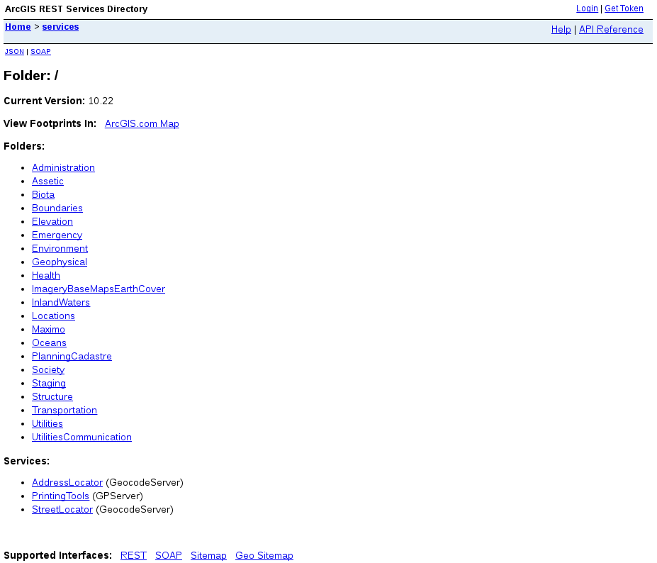
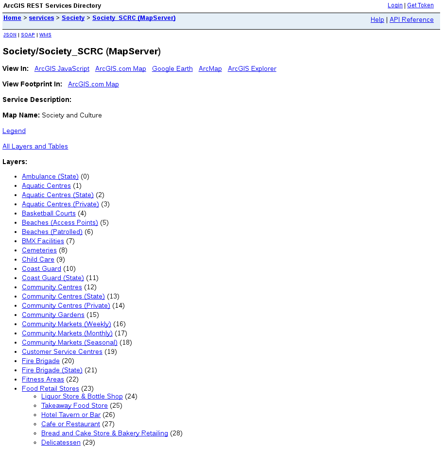
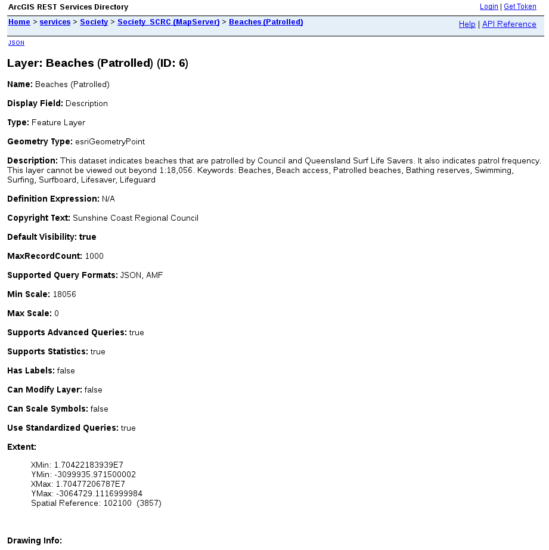
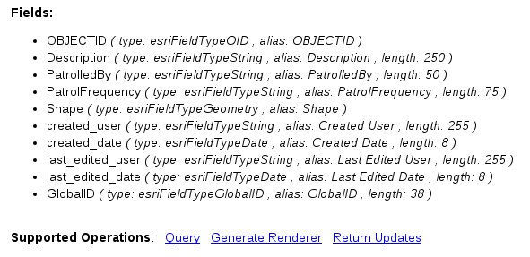
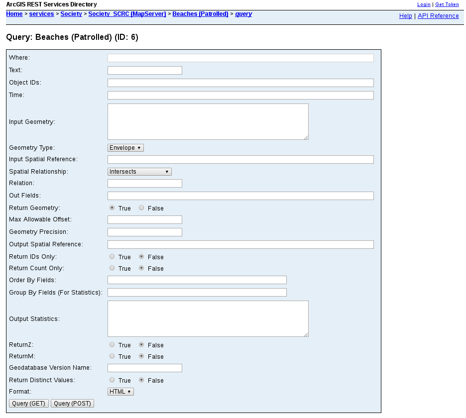
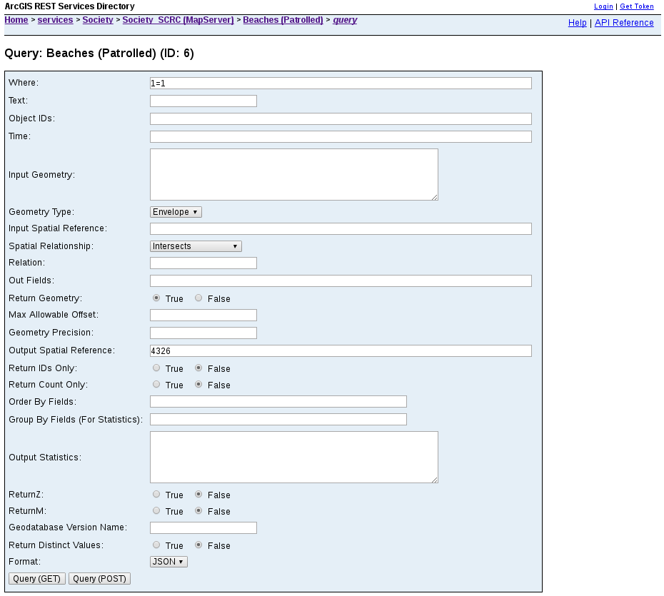
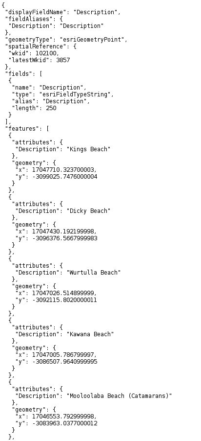

# ArcGIS Examples: Getting data out, the easy way

### Caveats

The type of data ArcGIS returns is not suitable to plug straight into most
mapping libraries. At the end of this example you will want to refer to our
example for converting ArcGIS JSON to GeoJSON.

This is not a suitable way to retrieve large data sets. In general it will be
restricted to a maximum of 1000 records (by the server).

It also ignores the requirement of some ArcGIS servers to use an authentication
token. This shouldn't be a problem for open data.


### Finding Data

You should have a url like this one
[http://gisservices.scc.qld.gov.au/arcgis/rest/services/](http://gisservices.scc.qld.gov.au/arcgis/rest/services/).

Open it in your browser of choice and you should be presented with a list of
folders like this...  


For the purpose of this example we are going to find a list of patrolled 
beaches. Once you have completed this example feel free to have a look
around to see what other data sets are available from the ArcGIS server you are
using.

The beaches are, at the time of typing this, under ```Society/Society_SCRC```.
So click on the ```Society``` link, and then the ```Society/Society_SCRC```
link on the next page.

You should now have a page with a list of layers like this...  


The patrolled beaches layer is towards the top of the list as 
```Beaches (Patrolled)```. Clicking on that option will get you a page with
information on the layer like this...  


If you scroll to the end of the page you will get a list of the fields for each
item in the layer and the supported operations. The operation we want is ```Query```.  


Click on the ```Query``` link and you should be presented with a page like
this...  


We are going to change the ```Where``` clause to ```1=1``` and the ```Format```
option to ```JSON``` as shown here...  


Once you are ready click the ```Query (GET)``` button and you should get some
results like this...  


You should now be able to save the page (CTRL+S should do it). If the data set
is one that changes regularly take note of the url that has been used so you
can easily fetch it again. In this case it is
[http://gisservices.scc.qld.gov.au/arcgis/rest/services/Society/Society_SCRC/MapServer/6/query?where=1%3D1&text=&objectIds=&time=&geometry=&geometryType=esriGeometryEnvelope&inSR=&spatialRel=esriSpatialRelIntersects&relationParam=&outFields=&returnGeometry=true&maxAllowableOffset=&geometryPrecision=&outSR=&returnIdsOnly=false&returnCountOnly=false&orderByFields=&groupByFieldsForStatistics=&outStatistics=&returnZ=false&returnM=false&gdbVersion=&returnDistinctValues=false&f=pjson](http://gisservices.scc.qld.gov.au/arcgis/rest/services/Society/Society_SCRC/MapServer/6/query?where=1%3D1&text=&objectIds=&time=&geometry=&geometryType=esriGeometryEnvelope&inSR=&spatialRel=esriSpatialRelIntersects&relationParam=&outFields=&returnGeometry=true&maxAllowableOffset=&geometryPrecision=&outSR=&returnIdsOnly=false&returnCountOnly=false&orderByFields=&groupByFieldsForStatistics=&outStatistics=&returnZ=false&returnM=false&gdbVersion=&returnDistinctValues=false&f=pjson)

And that's it. You should be able to apply this method to a lot of the data
layers available. Some layers will be pre-rendered image based layers. You
won't be able to export them in the same way. You can still use them on your
own maps, but that's a tale for another example.